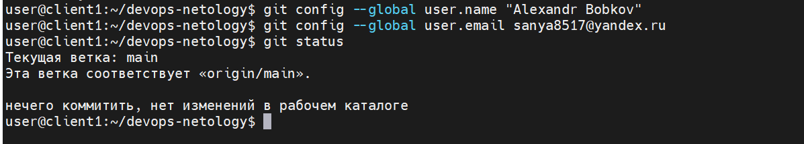
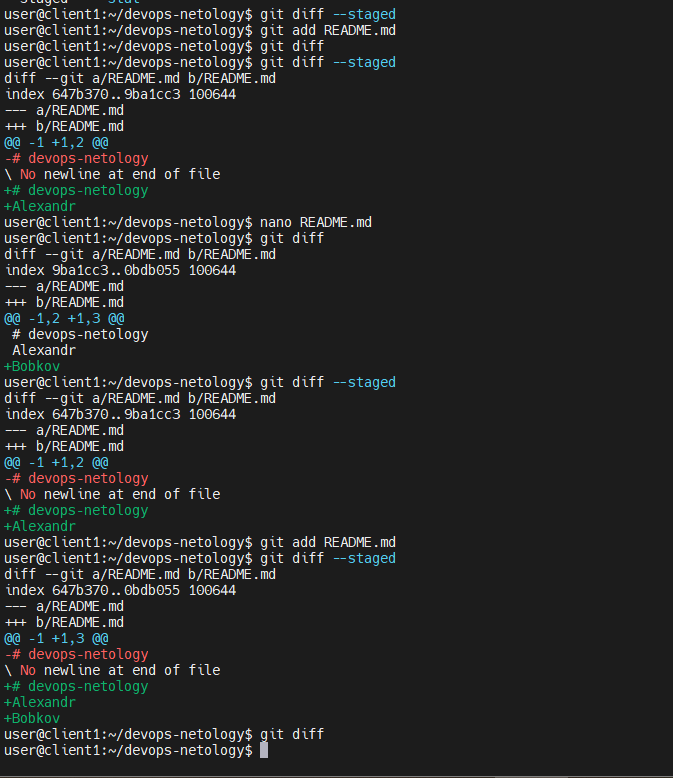
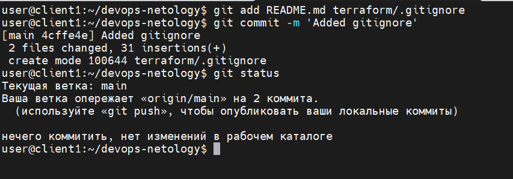
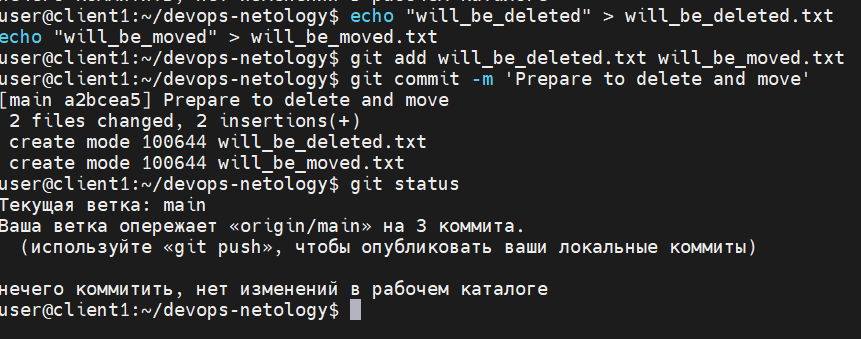
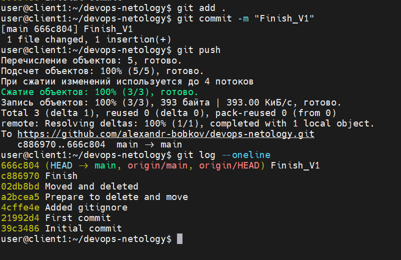

<details>
<summary><b>Задание</b></summary>

# Домашнее задание к занятию «Системы контроля версий»

### Цель задания

В результате выполнения задания вы: 

* научитесь подготоваливать новый репозиторий к работе;
* сохранять, перемещать и удалять файлы в системе контроля версий.  


### Чеклист готовности к домашнему заданию

1. Установлена консольная утилита для работы с Git.


### Инструкция к заданию

1. Домашнее задание выполните в GitHub-репозитории. 
2. В личном кабинете отправьте на проверку ссылку на ваш репозиторий с домашним заданием.
3. Любые вопросы по решению задач задавайте в разделе "Вопросы по заданию".


### Дополнительные материалы для выполнения задания

1. [GitHub](https://github.com/).
2. [Инструкция по установке Git](https://git-scm.com/downloads).
3. [Книга про  Git на русском языке](https://git-scm.com/book/ru/v2/) - рекомендуем к обязательному изучению главы 1-7.
   
   
------

## Задание 1. Создать и настроить репозиторий для дальнейшей работы на курсе

В рамках курса вы будете писать скрипты и создавать конфигурации для различных систем, которые необходимо сохранять для будущего использования. 
Сначала надо создать и настроить локальный репозиторий, после чего добавить удалённый репозиторий на GitHub.

### Создание репозитория и первого коммита

1. Зарегистрируйте аккаунт на [https://github.com/](https://github.com/). Если предпочитаете другое хранилище для репозитория, можно использовать его.
2. Создайте публичный репозиторий, который будете использовать дальше на протяжении всего курса, желательное с названием `devops-netology`.
   Обязательно поставьте галочку `Initialize this repository with a README`. 
   
    
    
3. Создайте [авторизационный токен](https://docs.github.com/en/authentication/keeping-your-account-and-data-secure/creating-a-personal-access-token) для клонирования репозитория.
4. Склонируйте репозиторий, используя протокол HTTPS (`git clone ...`).
 
    
    
5. Перейдите в каталог с клоном репозитория (`cd devops-netology`).
6. Произведите первоначальную настройку Git, указав своё настоящее имя, чтобы нам было проще общаться, и email (`git config --global user.name` и `git config --global user.email johndoe@example.com`). 
7. Выполните команду `git status` и запомните результат.
8. Отредактируйте файл `README.md` любым удобным способом, тем самым переведя файл в состояние `Modified`.
9. Ещё раз выполните `git status` и продолжайте проверять вывод этой команды после каждого следующего шага. 
10. Теперь посмотрите изменения в файле `README.md`, выполнив команды `git diff` и `git diff --staged`.
11. Переведите файл в состояние `staged` (или, как говорят, просто добавьте файл в коммит) командой `git add README.md`.
12. И ещё раз выполните команды `git diff` и `git diff --staged`. Поиграйте с изменениями и этими командами, чтобы чётко понять, что и когда они отображают. 
13. Теперь можно сделать коммит `git commit -m 'First commit'`.
14. И ещё раз посмотреть выводы команд `git status`, `git diff` и `git diff --staged`.

### Создание файлов `.gitignore` и второго коммита

1. Создайте файл `.gitignore` (обратите внимание на точку в начале файла), проверьте его статус сразу после создания. 
1. Добавьте файл `.gitignore` в следующий коммит (`git add...`).
1. На одном из следующих блоков вы будете изучать `Terraform`, давайте сразу создадим соотвествующий каталог `terraform` и внутри этого каталога — файл `.gitignore` по примеру: https://github.com/github/gitignore/blob/master/Terraform.gitignore.  
1. В файле `README.md` опишите своими словами, какие файлы будут проигнорированы в будущем благодаря добавленному `.gitignore`.
1. Закоммитьте все новые и изменённые файлы. Комментарий к коммиту должен быть `Added gitignore`.

### Эксперимент с удалением и перемещением файлов (третий и четвёртый коммит)

1. Создайте файлы `will_be_deleted.txt` (с текстом `will_be_deleted`) и `will_be_moved.txt` (с текстом `will_be_moved`) и закоммите их с комментарием `Prepare to delete and move`.
1. В случае необходимости обратитесь к [официальной документации](https://git-scm.com/book/ru/v2/Основы-Git-Запись-изменений-в-репозиторий) — здесь подробно описано, как выполнить следующие шаги. 
1. Удалите файл `will_be_deleted.txt` с диска и из репозитория. 
1. Переименуйте (переместите) файл `will_be_moved.txt` на диске и в репозитории, чтобы он стал называться `has_been_moved.txt`.
1. Закоммитьте результат работы с комментарием `Moved and deleted`.

### Проверка изменения

1. В результате предыдущих шагов в репозитории должно быть как минимум пять коммитов (если вы сделали ещё промежуточные — нет проблем):
    * `Initial Commit` — созданный GitHub при инициализации репозитория. 
    * `First commit` — созданный после изменения файла `README.md`.
    * `Added gitignore` — после добавления `.gitignore`.
    * `Prepare to delete and move` — после добавления двух временных файлов.
    * `Moved and deleted` — после удаления и перемещения временных файлов. 
2. Проверьте это, используя комманду `git log`. Подробно о формате вывода этой команды мы поговорим на следующем занятии, но посмотреть, что она отображает, можно уже сейчас.

### Отправка изменений в репозиторий

Выполните команду `git push`, если Git запросит логин и пароль — введите ваши логин и пароль от GitHub. 

В качестве результата отправьте ссылку на репозиторий. 

----

### Правила приёма домашнего задания

В личном кабинете отправлена ссылка на ваш репозиторий.


### Критерии оценки

Зачёт:

* выполнены все задания;
* ответы даны в развёрнутой форме;
* приложены соответствующие скриншоты и файлы проекта;
* в выполненных заданиях нет противоречий и нарушения логики.

На доработку:

* задание выполнено частично или не выполнено вообще;
* в логике выполнения заданий есть противоречия и существенные недостатки. 

</details>

-------
-------


<details>
<summary><b>Ответ</b></summary>


# devops-netology
Alexandr
Bobkov

### Какие файлы Terraform игнорируются Git и почему:
<details>
<summary><b>Расшифровка правил игнорирования файлов (.gitignore)</b></summary>

На основе синтаксиса файла `.gitignore` в будущем будут игнорироваться следующие файлы и папки:

1. **Конкретные папки и файлы по их точному имени:**
   * `.terraform/` — будет проигнорирована любая папка с точным именем `.terraform` (вместе со всем её содержимым) в любом месте репозитория.
   * `crash.log`, `.terraformrc`, `terraform.rc` — будут игнорироваться конкретные файлы с такими точными именами.

2. **Файлы с определенным расширением (маска `*`):**
   * `*.tfstate` — будут игнорироваться все файлы, имя которых заканчивается на `.tfstate` (символ `*` заменяет любые символы в названии).
   * `*.tfvars` и `*.tfvars.json` — будут игнорироваться все файлы с расширениями `.tfvars` и `.tfvars.json`.
   * `override.tf` и `override.tf.json` — будут игнорироваться файлы с такими точными именами.

3. **Файлы по сложным шаблонам с использованием символа `*`:**
   * `*.tfstate.*` — будут игнорироваться файлы, у которых в середине имени есть расширение `.tfstate`, а после него через точку идет любое продолжение (например, `terraform.tfstate.backup`).
   * `crash.*.log` — будут игнорироваться файлы, имя которых начинается на `crash.`, заканчивается на `.log`, а между ними может быть любой текст (например, `crash.2026-08-15.log`).
   * `*_override.tf` и `*_override.tf.json` — будут игнорироваться все файлы, имя которых заканчивается на `_override.tf` или `_override.tf.json` (например, `main_override.tf`).

<details>

-----

<details>
<summary><b>Как устроен язык правил (синтаксис) .gitignore</b></summary>
### Как устроен язык правил (синтаксис) .gitignore

Файл `.gitignore` управляет тем, какие файлы Git должен пропускать. Правила строятся на основе шаблонов (масок) со специальными символами:

1. **Простое имя файла или папки (без спецсимволов)**
   * `debug.log` — заставит Git игнорировать файл с именем `debug.log` в абсолютно любой папке проекта.
   * `build` — проигнорирует и файл с именем `build`, и любую папку с именем `build` (вместе со всем содержимым).

2. **Символ косой черты (`/`) — фиксация пути**
   * Если правило начинается со слэша (`/config.txt`), Git проигнорирует файл `config.txt` **только** в корневой папке репозитория. Файл `src/config.txt` игнорироваться не будет.
   * Если правило заканчивается на слэш (`logs/`), Git поймет, что это **именно папка**, и будет игнорировать только директорию `logs` и всё, что внутри неё. Файл с именем `logs` (без расширения) игнорироваться не будет.

3. **Символ звездочки (`*`) — замена любых символов**
   * `*.exe` — проигнорирует вообще все файлы, имя которых заканчивается на `.exe` (символ `*` заменяет собой любое название).
   * `temp_*` — проигнорирует все файлы и папки, имена которых начинаются на `temp_` (например: `temp_data`, `temp_logs.txt`).
   * `*.test.*` — проигнорирует файлы, у которых в середине имени есть `.test.`, а по бокам может быть что угодно (например: `main.test.js`).

4. **Символ вопросительного знака (`?`) — замена одного символа**
   * `image?.png` — проигнорирует файлы `image1.png`, `imageA.png`, но **не** проигнорирует `image12.png` (так как знаки вопроса заменяют строго один символ).

5. **Двойная звездочка (`/**/`) — любой уровень вложенности**
   * `logs/**/*.txt` — проигнорирует все `.txt` файлы внутри папки `logs`, независимо от того, насколько глубоко они спрятаны (например: `logs/2026/august/error.txt`).

6. **Восклицательный знак (`!`) — инверсия (исключение из правил)**
   * Если вам нужно проигнорировать всю паблик-папку, кроме одного важного файла:
     ```text
     /secret_files/
     !/secret_files/allow.txt
     ```
     Git проигнорирует всё внутри папки `/secret_files/`, но файл `allow.txt` всё равно добавит в репозиторий.

</details>

-------

<details>
<summary><b>Рекомендации пр работе с Terraform</b></summary>

1. **Директория `.terraform/`**
   * *Что это:* Папка, куда Terraform скачивает провайдеры (например, для AWS, Yandex Cloud) и модули.

2. **Файлы состояния (`*.tfstate` и `*.tfstate.backup`)**
   * *Что это:* Главные файлы, где Terraform хранит текущую карту реальной инфраструктуры.

3. **Файлы переменных с секретами (`*.tfvars` и `*.tfvars.json`)**
   * *Что это:* Файлы, в которые записываются конкретные значения переменных (например, `db_password = "secret-password"`).

4. **Файлы блокировки конвейера (`.terraform.lock.hcl`)**

5. **Файлы с логами ошибок (`crash.log`, `crash.*.log`)** — временные файлы отладки, которые нужны только локально при сбоях.

6. **Файлы переопределений (`*override.tf`, `*override.tf.json`)** — локальные настройки разработчика, которые используются для временных тестов на своей машине.

7. **Конфигурация интерфейса командной строки (`.terraformrc`, `terraform.rc`)** — глобальные настройки самого инструмента Terraform под конкретного пользователя.
</details>

------

> ** Скриншоты»:** 📸
> 
> 
> 
> 
> 


Главное отличие между командами `git diff` и `git diff --staged` заключается в том, **в какой именно зоне (области) Git** они ищут изменения. 

Git делит рабочий процесс на три зоны:
1. **Рабочая директория (Working Directory)** — файлы, которые вы редактируете прямо сейчас.
2. **Индекс / Стадия (Staging Area / Index)** — «черновик» будущего коммита, куда файлы попадают после команды `git add`.
3. **История (Repository / HEAD)** — сохраненные коммиты.

---

### 1. `git diff` (без флагов)
Показывает изменения, которые сделали в коде, но **еще НЕ подготовили к коммиту** (не вызывали для них `git add`).

---

### 2. `git diff --staged` (или `git diff --cached`)
Показывает изменения, которые  **УЖЕ подготовили к коммиту** (уже выполнили команду `git add`).

</details>

-----
-----
